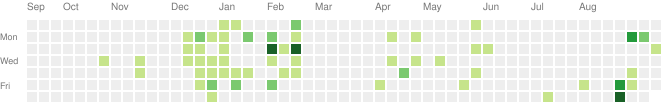

# 👋 Halo, Saya **Muhammad Arif**!

  

  
  
  

---

## 🧑‍💻 Tentang Saya

> Seorang pengembang web yang berfokus pada **PHP & Laravel**, senang membangun aplikasi web yang cepat, efisien, dan user-friendly. Saya percaya bahwa kode yang baik adalah kode yang mudah dibaca, dirawat, dan dipahami oleh orang lain.

- 🌱 Saat ini sedang mendalami **Laravel**, **Vue.js**, dan **TailwindCSS**
- 💡 Suka mengeksplorasi teknologi baru dan best practices pengembangan web
- 🎯 Tujuan: Membangun web yang berdampak dan membantu banyak orang
- 📫 Hubungi aku : **apalahkm3tuh@gmail.com**

---

## 🛠 Tech Stack & Tools

### 🌐 Languages & Frameworks

### 🗄️ Database

### 🔧 Tools & Environment

---

## 📊 Statistik GitHub

  
  

  

<!-- 🐍 Snake Animation -->

  

  

  

---

## 📬 Kontak

  

---

  

  <i>⭐ Jangan lupa <b>Star</b> dan <b>Follow</b> jika kamu suka! 🙌</i>

